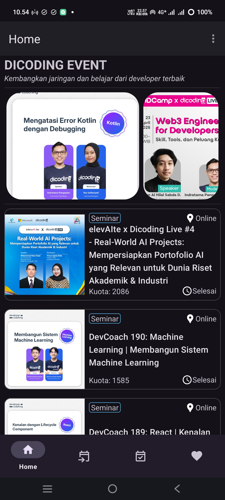
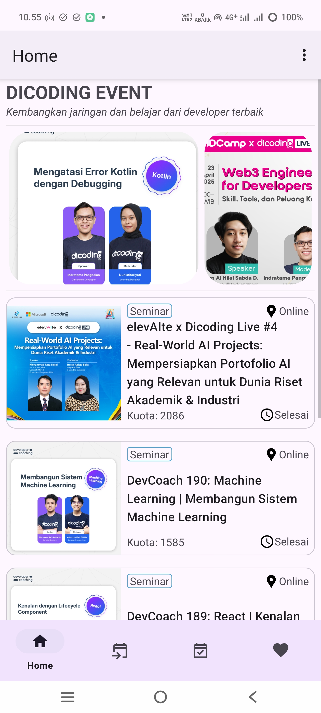
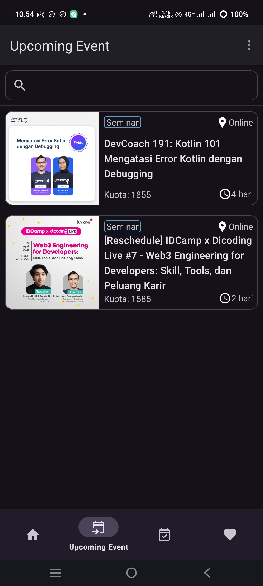
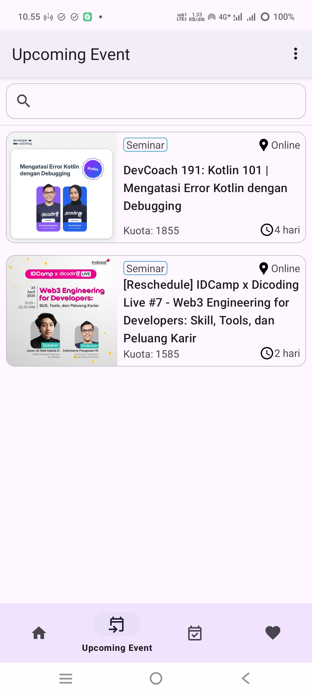
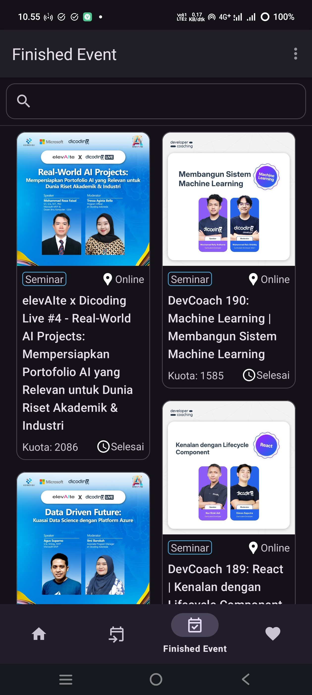
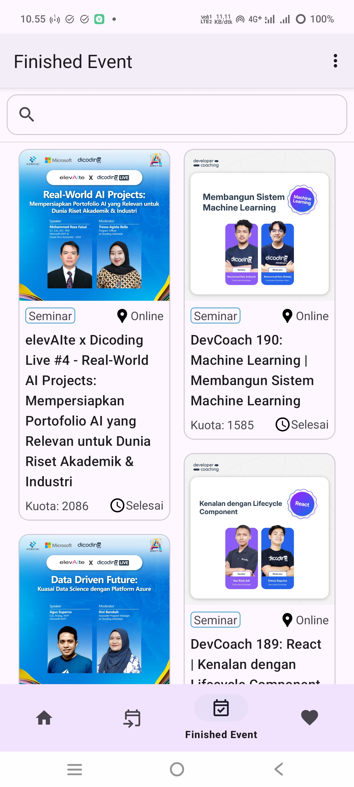
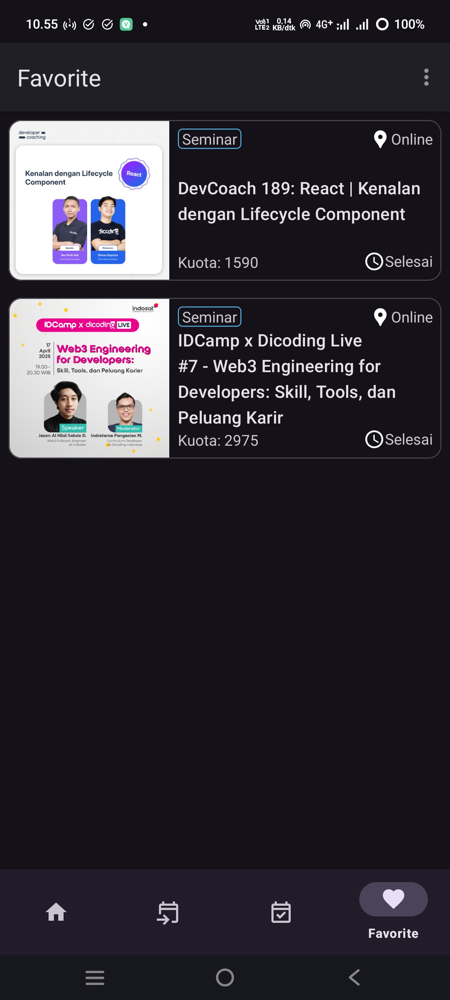
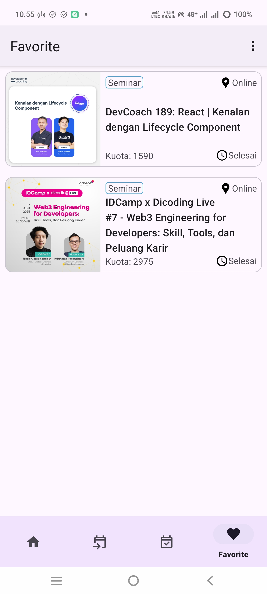
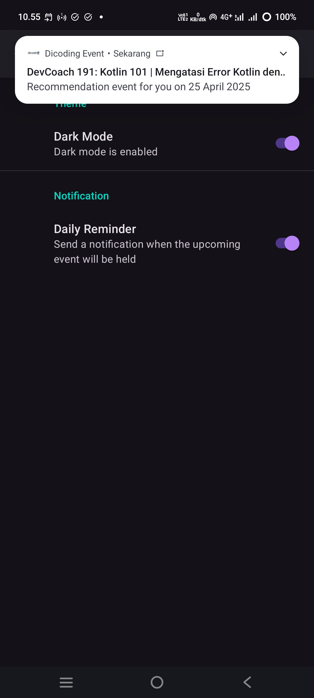

# DEvent

**DEvent** is an Android app that lets you view [dicoding events](https://www.dicoding.com/events),
you can also save your favorite events and remind you every day when there's an event going on.

### UI: Home

### UI: Upcoming Event

### UI: Finished Event

### UI: Favorite

### UI: Setting

